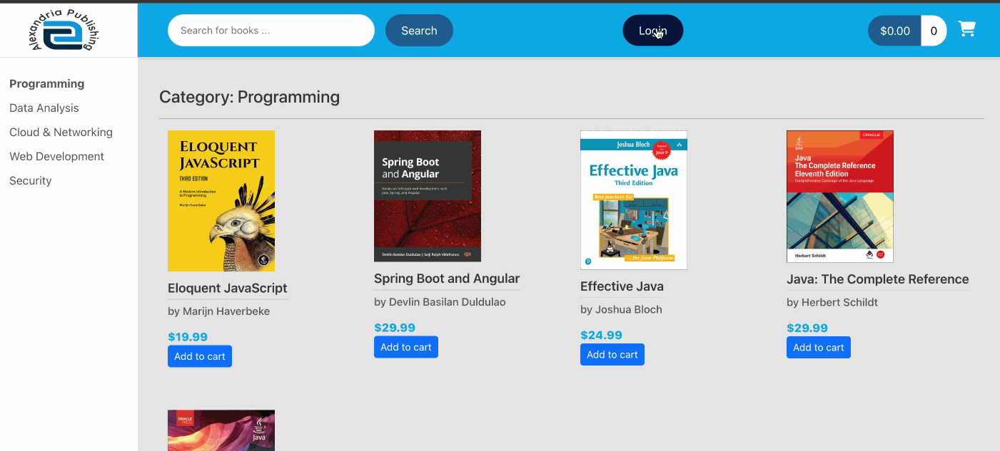

# *BookHubApp*

**BookHubApp** is a web application that allows users to buy books online.Users of the system: visitors/browsers, registered customers, store clerks, store managers/super-users.

## Main features of the system

* [x] The online store has a home page showing the lists of books
* [x] The system provides different categories for the books.
* [x] A visitor can browse the listings of the books.
* [x] A visitor can view the details of the books.
* [x] A visitor can search books by name or keyword.
* [ ] A visitor can apply to be a registered customer with a unique working email address.
* [x] A user can add books to the shopping cart and update the shopping cart items.
* [x] A user can purchase books and view his/her orders.
* [x] A registered customer must provide a working credit card or deposit money to the account for possible purchase.
* [x] A registered customer can browse the system, make purchase options, and search info.
* [x] A user can browse his/her purchasing history, comments and (start) votes on the items he/she already purchased.
* [x] Incorporated Okta Authorization Server to facilitate user login and logout functionalities.
* [x] Integrated Stripe payment gateway that allows users to make payments with debit/credit cards. 

## Spring Boot Backend
[BookHub - Online Bookstore](https://github.com/MinhazRahman/book-hub)

## Video Walkthrough

## Homepage

## Search

## Shopping Cart

## Login and Orders

GIF created with [LiceCap](http://www.cockos.com/licecap/).

## Notes

Describe any challenges encountered while building the app.

This project was generated with [Angular CLI](https://github.com/angular/angular-cli) version 15.2.6.

## Development server

Run `ng serve` for a dev server. Navigate to `http://localhost:4200/`. The application will automatically reload if you change any of the source files.

## Code scaffolding

Run `ng generate component component-name` to generate a new component. You can also use `ng generate directive|pipe|service|class|guard|interface|enum|module`.

## Build

Run `ng build` to build the project. The build artifacts will be stored in the `dist/` directory.

## Running unit tests

Run `ng test` to execute the unit tests via [Karma](https://karma-runner.github.io).

## Running end-to-end tests

Run `ng e2e` to execute the end-to-end tests via a platform of your choice. To use this command, you need to first add a package that implements end-to-end testing capabilities.

## Further help

To get more help on the Angular CLI use `ng help` or go check out the [Angular CLI Overview and Command Reference](https://angular.io/cli) page.
